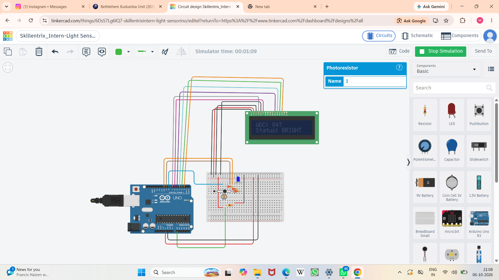

#  Light Intensity Monitoring System

An Arduino-based Light Intensity Monitoring System developed and simulated using Tinkercad Circuits.

## Project Overview

This project monitors the intensity of light using an LDR (Light Dependent Resistor).

The Arduino reads the light intensity and displays the corresponding information on an LCD. LEDs are also used to indicate different light intensity levels.

##  Objective

The main objective of this project is to demonstrate how an Arduino can be used to sense and monitor environmental light intensity using an LDR sensor.

##  Components Used

- Arduino Uno R3
- LDR (Light Dependent Resistor)
- 16x2 LCD Display
- LEDs
- Resistors
- Breadboard
- Jumper Wires

## Working Principle

The LDR senses the amount of light falling on it and produces an analog value.

The Arduino reads this value and compares it with predefined threshold levels.

Based on the detected light intensity:

- The LCD displays the light intensity information.
- LEDs indicate different light conditions.

## Technologies Used

- Arduino
- Embedded C / Arduino Programming
- Tinkercad Circuits

## 🔬 Simulation

This project was designed and tested using Tinkercad Circuits.

🔗 **Live Tinkercad Simulation:**  
PASTE YOUR TINKERCAD LINK HERE

## Circuit

##  Learning Outcomes

Through this project, I gained practical understanding of:

- Arduino programming
- Analog sensor input
- LDR-based light sensing
- LCD interfacing
- LED control
- Basic embedded systems
- Circuit simulation using Tinkercad

##  Author
mounika
B.Tech  ECE Student
